# Email Automation System - Process Flow Diagrams

## 🎯 SYSTEM OVERVIEW


---

## 📋 FORM SUBMISSION TO EMAIL AUTOMATION FLOW


---

## ⚖️ CONSULTATION BOOKING FLOW


---

## 📧 EMAIL PROCESSING & DELIVERY FLOW


---

## 🎛️ ADMIN DASHBOARD DATA FLOW


---

## 🔄 PATHWAY ASSIGNMENT LOGIC


---

## 🛡️ LEGAL COMPLIANCE FLOW


---

## 📊 DATABASE SCHEMA RELATIONSHIPS


---

## 🚀 EMAIL TEMPLATE SYSTEM ARCHITECTURE


---

## 🔧 ADMIN DASHBOARD CONTROLS FLOW

```mermaid
flowchart LR
    A[Admin Dashboard] --> B{User Action}
    
    B -->|Pause Contact| C[Pause Email Sequence]
    B -->|Resume Contact| D[Resume Email Sequence]
    B -->|Preview Email| E[Generate Email Preview]
    B -->|Send Email Now| F[Immediate Email Send]
    B -->|View Analytics| G[Load Performance Data]
    
    C --> H[Update automation status = 'paused']
    C --> I[Update pending emails = 'paused']
    
    D --> J[Update automation status = 'active']
    D --> K[Reschedule paused emails]
    
    E --> L[Generate HTML template]
    E --> M[Return preview in new tab]
    
    F --> N[Update send_at = now()]
    F --> O[Trigger immediate processing]
    
    G --> P[Query engagement metrics]
    G --> Q[Calculate conversion rates]
    
    H --> R[Log admin action]
    J --> R
    N --> R
    
    R --> S[Update dashboard display]
    L --> T[Open preview window]
    P --> U[Display analytics charts]
```

---

## ✅ SYSTEM STATUS & HEALTH MONITORING


---

## 🎯 TESTING & VALIDATION FLOW

```mermaid
flowchart LR
    A[Test Execution] --> B[Form Submission Test]
    A --> C[Email Template Test]
    A --> D[Consultation Flow Test]
    A --> E[Dashboard UI Test]
    
    B --> F[Submit Test Form]
    F --> G[Verify Lead Creation]
    G --> H[Verify Automation Trigger]
    H --> I[Verify Email Scheduling]
    
    C --> J[Generate Template]
    J --> K[Check Legal Compliance]
    K --> L[Verify Personalization]
    L --> M[Validate HTML Structure]
    
    D --> N[Test Booking Webhook]
    N --> O[Verify Sequence Pause]
    O --> P[Test Cancellation Webhook]
    P --> Q[Verify Sequence Resume]
    
    E --> R[Load Dashboard]
    R --> S[Test API Endpoints]
    S --> T[Verify Real-time Updates]
    T --> U[Test Admin Controls]
    
    I --> V[✅ Form Integration Working]
    M --> W[✅ Templates Compliant]
    Q --> X[✅ Consultation Flow Working]
    U --> Y[✅ Dashboard Functional]
    
    V --> Z[System Ready for Production]
    W --> Z
    X --> Z
    Y --> Z
```



---

## 🏆 PRODUCTION DEPLOYMENT ARCHITECTURE


This comprehensive visualization shows every aspect of your email automation system working together seamlessly!